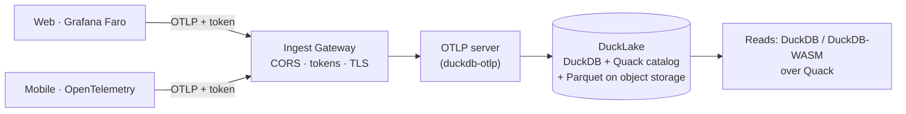

# nilalytics

**Serverless, self‑hosted realtime analytics for web and mobile — on your own object storage.**

nilalytics collects product events, errors, and performance data over
[OpenTelemetry](https://opentelemetry.io/) (OTLP), stores them in a
[DuckLake](https://ducklake.select/) lakehouse on any major cloud's object
storage, and serves sub‑second reads over DuckDB's [Quack](https://duckdb.org/docs/stable/core_extensions/quack) protocol — no warehouse, no per‑event fees, no data leaving your infrastructure.

- **One SDK per platform:** Grafana Faro (web) or OpenTelemetry SDKs (mobile) → OTLP.
- **Runs on any cloud:** S3, MinIO, Google Cloud Storage, Cloudflare R2, or Azure / ADLS Gen2.
- **Small files solved:** DuckLake data inlining keeps streaming writes fast and cheap.
- **Batteries included:** funnels, retention, errors, traces, metrics, cross‑device identity.
- **Secure by default:** token‑authenticated ingest, read‑only query authz, a hardened public gateway.

📖 **Full documentation:** <https://angelerator.github.io/nilalytics/>

## Install

```bash
pip install git+https://github.com/Angelerator/nilalytics
```

## 60‑second local demo

```bash
# 1. object storage (local MinIO)
minio server .minio-data --address 127.0.0.1:9100 --console-address 127.0.0.1:9101 &
mc alias set nila http://127.0.0.1:9100 minioadmin minioadmin
mc mb --ignore-existing nila/nilalytics

# 2. run the pipeline
nilalytics server &      # ingest + Quack catalog
nilalytics gateway &     # public ingest gateway (CORS + tokens)

# 3. send + query
nilalytics emit --count 200 --persons 5
nilalytics query report
```

## Architecture



## Acknowledgements

nilalytics stands on the shoulders of giants. Huge thanks to
[DuckDB](https://duckdb.org/), [DuckLake](https://ducklake.select/) and Quack (DuckDB Labs / DuckDB Foundation),
[duckdb‑otlp](https://github.com/smithclay/duckdb-otlp) ([@smithclay](https://github.com/smithclay)),
[OpenTelemetry](https://opentelemetry.io/) (CNCF),
[Grafana Faro](https://github.com/grafana/faro-web-sdk) (Grafana Labs),
and [MinIO](https://min.io/) — plus the projects that inspired it:
[canardstack](https://github.com/smithclay/canardstack),
[icelight](https://github.com/cliftonc/icelight), and
[stratif.io](https://stratif.io/).

Full credits and dependency list: [Acknowledgements](https://angelerator.github.io/nilalytics/acknowledgements/).

## License

[Apache‑2.0](LICENSE) © Angelerator

