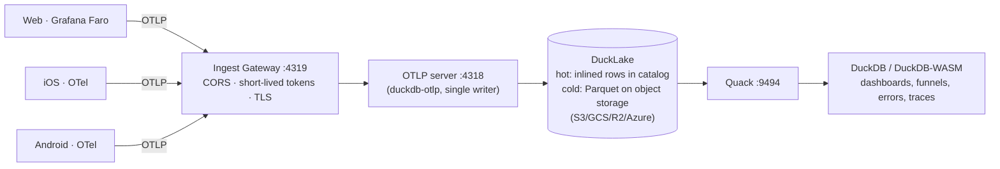

# Architecture

nilalytics is a thin pipeline over proven pieces: OpenTelemetry for collection,
DuckLake for storage, DuckDB for compute, and Quack for serving.

## The pieces

**Emitter (client).** Any OTLP producer. On the web that's **Grafana Faro** (via
its OTLP transport); on mobile it's an **OpenTelemetry SDK**. Everything becomes
OTLP logs (events + errors), spans (performance), and metrics.

**Ingest gateway.** The public front door. It adds CORS (so browsers can post),
verifies **short‑lived tokens** (so no long‑lived secret ships in a client),
optionally terminates TLS, and forwards to the internal OTLP server. See
[Ingest gateway](ingest-gateway.md).

**OTLP server (`duckdb-otlp`).** An embedded HTTP server inside a DuckDB process.
It buffers incoming OTLP and commits batches into the DuckLake, then runs
best‑effort compaction. It is the single writer.

**DuckLake.** The lakehouse format: a **catalog** (metadata) + **Parquet** (data
on object storage). nilalytics uses a **DuckDB catalog served over Quack**, so
many clients can read/write through one server.

- **Data inlining:** small writes land as rows *inside the catalog* — no tiny
  Parquet files. This is what makes streaming ingestion fast and cheap.
- **Checkpoints:** flush inlined rows to Parquet and merge small files.

**Read path (Quack).** Dashboards and DuckDB‑WASM connect to the Quack server and
run SQL against the lake — they never touch object‑storage credentials. Reads are
restricted to a read‑only authorization policy.

## Two data tiers

| Tier | Where | Speed | Used for |
|------|-------|-------|----------|
| **Hot** | inlined rows in the catalog | sub‑second | "right now" dashboards |
| **Cold** | Parquet on object storage | fast, cheap | history / heavy analysis |

Queries transparently combine both.

## Signals → tables

| Signal | OTLP kind | DuckLake table |
|--------|-----------|----------------|
| product events, errors, logs | logs | `otlp_logs` |
| performance (page load, API) | traces | `otlp_traces` |
| web‑vitals, counters | metrics | `otlp_metrics_*` |

## Processes you run

- `nilalytics server` — the OTLP server + Quack catalog.
- `nilalytics gateway` — the public ingest gateway.
- (optional) a scheduled `nilalytics maintenance` for compaction/retention.

Everything is configured with environment variables — see [Configuration](configuration.md).
