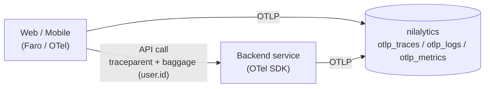

# Backend activity (server-side)

Your backend is **just another OTLP source**. Point an OpenTelemetry SDK at
nilalytics and every request/operation becomes a span — **successful or not** —
and, if you propagate identity, it's tied to the same user (and even the same
client action) as your web/mobile events.



Nothing new to ingest — backend telemetry lands in the same tables and is
queried the same way.

## 1. Instrument the backend

Most OTel SDKs auto-instrument the web framework, so every request becomes a
span with method, route, status and duration. Example (FastAPI):

```python
from opentelemetry import trace
from opentelemetry.sdk.trace import TracerProvider
from opentelemetry.sdk.trace.export import BatchSpanProcessor
from opentelemetry.exporter.otlp.proto.http.trace_exporter import OTLPSpanExporter
from opentelemetry.instrumentation.fastapi import FastAPIInstrumentor

provider = TracerProvider()
provider.add_span_processor(BatchSpanProcessor(OTLPSpanExporter(
    endpoint="http://nilalytics-host:4318/v1/traces",
    headers={"Authorization": "Bearer <ingest-token>"},
)))
trace.set_tracer_provider(provider)
FastAPIInstrumentor().instrument_app(app)   # each request → a span
```

The same pattern applies to Node (Express/Fastify), Go, Java, etc. — pick the
matching OpenTelemetry instrumentation.

## 2. Success or failure

Captured automatically, and easy to enrich:

- **Automatic:** a `4xx`/`5xx` response or an unhandled exception sets the span
  **status = ERROR** and records the exception.
- **Explicit** business outcome:

```python
span = trace.get_current_span()
try:
    do_checkout()
    span.set_attribute("outcome", "success")
except PaymentError as exc:
    span.set_attribute("outcome", "failed")
    span.record_exception(exc)
    span.set_status(Status(StatusCode.ERROR))
    raise
```

## 3. Tie it to the user (client ↔ backend)

Propagate **W3C trace context + baggage** so backend spans share the client's
`trace_id` and carry the same identity attributes.

```js
// browser (Faro): propagate trace headers to your API
new TracingInstrumentation({
  instrumentationOptions: { propagateTraceHeaderCorsUrls: [/api\.example\.com/] },
});
```

```python
# backend: read the propagated identity onto the span
from opentelemetry import baggage
span.set_attribute("user.id", baggage.get_baggage("user.id"))
```

Now a backend request links to **the same person** (`user.id`) and **the same
client action** (`trace_id`). See [Identity & cross-device](identity.md).

## 4. Auth for backends

Backends are **trusted servers**, so they skip the browser flow:

- Send OTLP **directly to the ingest server** (`:4318`) on your private network
  with the ingest token (`NILA_OTLP_TOKEN`) — no gateway, no CORS.
- Or route through the [gateway](ingest-gateway.md) with a minted token if the
  backend is outside the trusted network.

## 5. Query it

Backend spans land in `otlp_traces` (`status_code`: 1 = ok, 2 = error;
`duration_time_unix_nano`; `service_name`; `span_attributes`; `trace_id`). Query
over Quack (see [Querying](querying.md)):

```sql
-- success / failure + latency per backend route
FROM remote.query('
  SELECT json_extract_string(span_attributes, ''$."http.route"'') AS route,
         count(*) AS calls,
         count(*) FILTER (WHERE status_code = 2) AS errors,
         round(quantile_cont(duration_time_unix_nano, 0.95) / 1e6) AS p95_ms
  FROM lake.main.otlp_traces
  GROUP BY 1 ORDER BY calls DESC
');
```

```sql
-- one user's full journey: client events + backend spans, by shared trace_id
FROM remote.query('
  SELECT time_unix_nano, service_name, name, status_code
  FROM lake.main.otlp_traces
  WHERE trace_id = ''<trace-id>''
  ORDER BY time_unix_nano
');
```

This gives you end-to-end visibility: what the user did in the app **and**
whether the backend calls behind it succeeded — in one lake.
