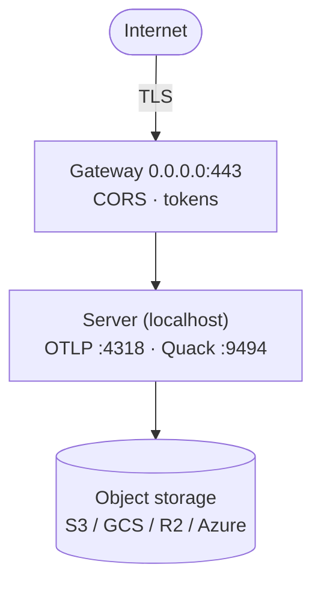

# Deployment

A production nilalytics deployment is: **object storage** + one **server**
process + one **gateway** process (+ a periodic maintenance job).

## Topology



- Expose **only the gateway**. Keep the OTLP server and Quack catalog on localhost.
- Terminate TLS at the gateway (`NILA_GATEWAY_CERT`/`KEY`) or a reverse proxy.

## Minimal production env

```bash
export NILA_DATA_DIR=/var/lib/nilalytics

# storage (example: S3)
export NILA_STORAGE=s3 NILA_S3_USE_SSL=true NILA_BUCKET=prod-analytics
export NILA_S3_KEY=... NILA_S3_SECRET=... NILA_S3_REGION=eu-west-1

# expose the gateway, restrict CORS, set the mint key
export NILA_GATEWAY_HOST=0.0.0.0
export NILA_GATEWAY_CORS=https://app.example.com
export NILA_INGEST_KEY=$(openssl rand -hex 24)

# stable secrets (don't rely on generated ones in prod)
export NILA_OTLP_TOKEN=$(openssl rand -hex 24)
export NILA_QUACK_TOKEN=$(openssl rand -hex 24)
export NILA_GATEWAY_SECRET=$(openssl rand -hex 24)
export NILA_ID_SALT=$(openssl rand -hex 24)
```

Run both processes (systemd units, containers, or K8s Deployments):

```bash
nilalytics server
nilalytics gateway
```

Schedule compaction (cron / systemd timer / K8s CronJob):

```bash
nilalytics maintenance
```

## Catalog choices

nilalytics uses a **DuckDB catalog served over Quack**. This is a single‑writer
server — great for single‑tenant / moderate scale.

- **Quack is beta** until DuckDB 2.0; the protocol may change.
- For higher write concurrency or HA, the alternative is a **PostgreSQL** catalog
  (e.g. Azure Database for PostgreSQL, Amazon RDS). This trades the "DuckDB end
  to end" simplicity for a managed multi‑writer database.

## Scaling notes (honest)

- **One writer.** All ingest funnels through one server process. Scale the
  **gateway** horizontally (stateless) in front; the writer is the bottleneck.
- **Sub‑second reads** come from inlined recent data. For high read concurrency,
  put a dedicated hot store (ClickHouse/quackpipe) beside the lake, or add read
  replicas when Quack replication lands.
- **Retention/compaction** must run, or small files accumulate. Keep the
  maintenance job scheduled.

## Cloud‑native fit

- **Storage:** any of S3 / GCS / R2 / Azure (see [Storage backends](storage-backends.md)).
- **Auth to storage:** prefer workload identity / managed identity (Azure
  `credential_chain`, AWS instance roles via `credential_chain`) over static keys.
- **Data dir:** a small persistent volume for the catalog file + secrets.

## Health checks

- Gateway: `GET /healthz` → `{"status":"ok"}`.
- Server: it prints `READY`; the OTLP server also exposes `/healthz` and
  `/readyz` internally.
