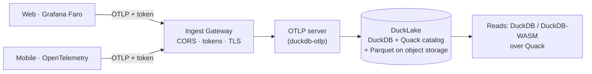

# nilalytics

**Serverless, self‑hosted realtime analytics for web and mobile — on your own object storage.**

nilalytics collects product events, errors, and performance data over
[OpenTelemetry](https://opentelemetry.io/) (OTLP), stores them in a
[DuckLake](https://ducklake.select/) lakehouse on any major cloud's object
storage, and serves sub‑second reads over DuckDB's
[Quack](https://duckdb.org/docs/stable/core_extensions/quack) protocol.

No data warehouse. No per‑event fees. No data leaving your infrastructure.

## Why nilalytics

- **One SDK per platform.** Grafana Faro on the web, OpenTelemetry SDKs on mobile — both speak OTLP.
- **Runs on any cloud.** S3, MinIO, Google Cloud Storage, Cloudflare R2, or Azure / ADLS Gen2 — switch with one env var.
- **No small‑files problem.** DuckLake *data inlining* keeps recent events in the catalog (hot) and flushes older data to Parquet (cold), so streaming stays fast and cheap.
- **Product analytics built in.** Funnels, retention, user paths, errors, traces, metrics.
- **Cross‑device identity.** Stitch a person across phone + web, pseudonymously.
- **Secure by default.** Token‑authenticated ingest, read‑only query authorization, and a hardened public gateway with short‑lived tokens, CORS, and optional TLS.

## How it fits together

## Where to go next

- New here? Start with [Install](install.md) then the [Quickstart](quickstart.md).
- Adding a **website**? See [Web (Grafana Faro)](web.md).
- Adding a **mobile app**? See [Mobile (OpenTelemetry)](mobile.md).
- Want the big picture? Read the [Architecture](architecture.md).

!!! note "Status"
    nilalytics builds on some young components (DuckLake, and DuckDB's **Quack**
    protocol, which is beta until DuckDB 2.0). It is production‑capable for
    single‑tenant / moderate scale today; see [Deployment](deployment.md) for the
    honest limits.
