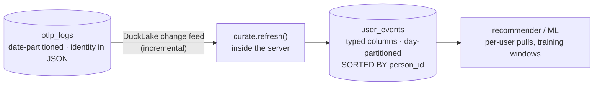

# User events (recommendations / ML)

Recommendations need one read above all: **"give me everything this person did."**
The raw `otlp_logs` table is tuned for *ingest* — it's date‑partitioned and keeps
identity inside a JSON column — so that per‑user read is slow.

nilalytics solves this with a curated **`user_events`** table: identity and the
common event fields lifted into **typed columns**, laid out so per‑user reads are
cheap. The server builds and refreshes it automatically.



## Why not just partition by `user_id`?

Because `user_id` is **high‑cardinality** (potentially millions of values), and a
partition makes one folder per value. That means **one folder per user per day** —
a flood of tiny Parquet files that makes writes, compaction and reads *slower*.

The right tool for a high‑cardinality key is **sorting (clustering)**, not
partitioning. DuckLake keeps per‑file min/max stats, so if rows are sorted by
`person_id`, a `WHERE person_id = …` query **skips** the files that can't match.

| | Partition by date + **sort by person** (what we do) | Partition by `user_id` (the trap) |
|---|---|---|
| Files | bounded (one set per day) | one set **per user per day** → millions of tiny files |
| Per‑user read | prunes to a few files | scans many tiny files |
| Streaming ingest | cheap | fragments every small batch |

## Schema

| Column | Type | Notes |
|--------|------|-------|
| `event_time` | `TIMESTAMP` | UTC, from the event's epoch‑ns time |
| `event_time_unix_nano` | `BIGINT` | exact ordering / watermark |
| `event` | `VARCHAR` | the event name (`page_view`, `purchase`, …) |
| `user_id` | `VARCHAR` | hashed person key; `NULL` before identify |
| `anonymous_id` | `VARCHAR` | device id |
| `session_id` | `VARCHAR` | session id |
| `person_id` | `VARCHAR` | **`user_id` if known, else `anonymous_id`** — the subject key you filter/sort on |
| `page` | `VARCHAR` | page/route |
| `severity_text` | `VARCHAR` | `INFO` / `ERROR` … |
| `service_name` | `VARCHAR` | emitting service |
| `attributes` | `VARCHAR` | the full original JSON (nothing is lost) |

Layout: `PARTITIONED BY day(event_time)` **+** `SORTED BY (person_id, event_time_unix_nano)`.

!!! note "person_id vs full stitching"
    `person_id` is a cheap "best‑known identity" per event. To roll a later‑known
    `user_id` **back** onto a device's earlier anonymous events (true cross‑device
    stitching), use the identity graph — see [Identity](identity.md).

## How it refreshes (incremental + safe)

The server appends only what's new, using the **DuckLake change feed**:

1. It records the last processed **snapshot id** as a watermark.
2. Each cycle it reads `table_changes(otlp_logs, last+1, current)` and appends the
   inserts.
3. The watermark advances **in the same transaction** as the insert — so a failure
   just retries the same range (no gaps, no duplicates).

Because the watermark is a **snapshot id, not a timestamp**, late‑ or
out‑of‑order events are never missed. The first run does a consistent full
backfill.

**In plain words:** it's a bookmark that only moves forward once the new rows are
safely written.

## Use it

```bash
nilalytics query user_events       # size, distinct persons, top activity, curation lag
nilalytics query user <person_id>  # one person's recent activity
```

Any SQL client (or DuckDB‑WASM) can read it over Quack:

```sql
-- a person's recent history (the recommender's input)
FROM remote.query('
  SELECT event_time, event, page
  FROM lake.main.user_events
  WHERE person_id = ''<person-id>''
  ORDER BY event_time_unix_nano DESC
  LIMIT 50
');
```

```sql
-- a training window: everyone active in the last 7 days
FROM remote.query('
  SELECT person_id, event, count(*) AS n
  FROM lake.main.user_events
  WHERE event_time > now() - INTERVAL ''7 days''
  GROUP BY 1, 2
');
```

The date partition keeps training windows cheap; the `person_id` sort keeps
per‑user pulls fast.

## Configuration

Everything is optional (see [Configuration](configuration.md)):

```bash
NILA_USER_EVENTS=true                       # on by default
NILA_USER_EVENTS_REFRESH_SECONDS=60         # append cadence
NILA_USER_EVENTS_PARTITION_BY="day(event_time)"
NILA_USER_EVENTS_SORTED_BY="person_id, event_time_unix_nano"
```

Set `NILA_USER_EVENTS=false` to turn curation off entirely.
