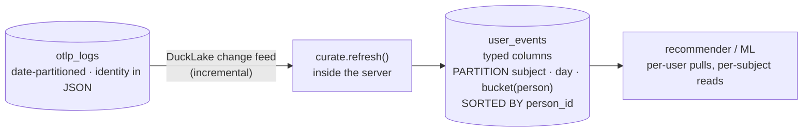

# User events (recommendations / ML)

Recommendations need one read above all: **"give me everything this person did."**
The raw `otlp_logs` table is tuned for *ingest* — it's date‑partitioned and keeps
identity inside a JSON column — so that per‑user read is slow.

nilalytics solves this with a curated **`user_events`** table: identity and the
common event fields lifted into **typed columns**, laid out so per‑user reads are
cheap. The server builds and refreshes it automatically.



## Layout: `subject` › `date` › `person`

```sql
PARTITIONED BY ( subject , day(event_time) , bucket(N, person_id) )
SORTED BY     ( person_id , event_time_unix_nano )
```

Three levels of pruning, chosen so every partition key stays **bounded**:

| Level | Key | Cardinality | Why |
|-------|-----|-------------|-----|
| 1 | `subject` | ~5 | category scans + per‑subject retention |
| 2 | `day(event_time)` | one/day | time windows + retention |
| 3 | **`bucket(N, person_id)`** | `N` (e.g. 16–256) | fast per‑person reads |

### Why `bucket(person_id)`, not raw `person_id`

Partitioning on **raw** `person_id` would make **one folder per person** — millions of
tiny files, which DuckLake (and every lakehouse) explicitly warns against; the sweet
spot is *hundreds to low‑thousands* of partitions.

**`bucket(N, person_id)`** hashes people into `N` folders instead. A single‑person
query still hits **only its one bucket** (skips `(N-1)/N` of the data), and the
`person_id` **sort** then prunes to that person's row groups inside the bucket — so
you get the per‑person speed *without* the tiny‑file explosion.

!!! tip "How DuckLake keeps files healthy"
    - **Data inlining** buffers tiny inserts in the catalog (no micro‑Parquet files).
    - **Compaction** (`nilalytics maintenance`) merges small files into ~512 MB ones,
      *within each partition*, without expiring snapshots.
    - **Sorting** is applied during compaction for up to ~10× read pruning.

    These are why bucketing is safe — but they only merge *within* a partition, so
    keep the partition count bounded (see [tuning](#tuning-for-your-volume)).

## Schema

| Column | Type | Notes |
|--------|------|-------|
| `event_time` | `TIMESTAMP` | UTC, from the event's epoch‑ns time |
| `event_time_unix_nano` | `BIGINT` | exact ordering / watermark |
| `subject` | `VARCHAR` | partition: `errors` / `activities` / `ai_usage` / `traceability` / `other` |
| `event` | `VARCHAR` | the event name (`page_view`, `purchase`, …) |
| `user_id` | `VARCHAR` | hashed person key; `NULL` before identify |
| `anonymous_id` | `VARCHAR` | device id |
| `session_id` | `VARCHAR` | session id |
| `person_id` | `VARCHAR` | **`user_id` if known, else `anonymous_id`** — the subject key you filter/sort on |
| `page` | `VARCHAR` | page/route |
| `severity_text` | `VARCHAR` | `INFO` / `ERROR` … |
| `service_name` | `VARCHAR` | emitting service |
| `attributes` | `VARCHAR` | the full original JSON (nothing is lost) |

!!! note "person_id vs full stitching"
    `person_id` is a cheap "best‑known identity" per event. To roll a later‑known
    `user_id` **back** onto a device's earlier anonymous events (true cross‑device
    stitching), use the identity graph — see [Identity](identity.md).

## Subjects

Every event is classified into one low‑cardinality **subject**. An explicit
`nila.subject` attribute wins; otherwise it is derived, and any unknown value is
clamped to `other` so the partition can never explode.

| Subject | Assigned when |
|---------|---------------|
| `errors` | severity `ERROR`, or an `exception.*` attribute |
| `ai_usage` | a `gen_ai.*` / `llm.*` attribute (model, tokens, …) |
| `traceability` | `identify`, or an `audit.*` attribute |
| `activities` | everything else (product events) — the default |
| `other` | an explicit `nila.subject` outside the set above |

## How it refreshes (incremental + safe)

The server appends only what's new, using the **DuckLake change feed**:

1. It records the last processed **snapshot id** as a watermark.
2. Each cycle it reads `table_changes(otlp_logs, last+1, current)` and appends the
   inserts.
3. The watermark advances **in the same transaction** as the insert — so a failure
   just retries the same range (no gaps, no duplicates).

Because the watermark is a **snapshot id, not a timestamp**, late‑ or
out‑of‑order events are never missed. The first run does a consistent full
backfill.

**In plain words:** it's a bookmark that only moves forward once the new rows are
safely written.

## Use it

```bash
nilalytics query user_events          # size, persons, subject breakdown, curation lag
nilalytics query user <person_id>     # one person's full activity + logs
nilalytics query user <person_id> 16  # same, limited to the last 16 days
nilalytics query subject errors 16    # everything in a subject, last 16 days
```

Any SQL client (or DuckDB‑WASM) can read it over Quack:

```sql
-- a person's activity + logs in the last 16 days (the recommender's input)
FROM remote.query('
  SELECT event_time, event, severity_text, page
  FROM lake.main.user_events
  WHERE person_id = ''<person-id>''
    AND event_time > now() - INTERVAL ''16 days''
  ORDER BY event_time_unix_nano DESC
');
```

```sql
-- all AI usage in the last 7 days (subject partition prunes straight to it)
FROM remote.query('
  SELECT json_extract_string(attributes, ''$."gen_ai.request.model"'') AS model,
         count(*) AS calls
  FROM lake.main.user_events
  WHERE subject = ''ai_usage'' AND event_time > now() - INTERVAL ''7 days''
  GROUP BY 1 ORDER BY calls DESC
');
```

`subject` + `day` prune the scan to the right folders; `bucket(person_id)` + the
`person_id` sort make single‑person pulls hit one bucket.

## Configuration

Everything is optional (see [Configuration](configuration.md)):

```bash
NILA_USER_EVENTS=true                # on by default
NILA_USER_EVENTS_REFRESH_SECONDS=60  # append cadence
NILA_USER_EVENTS_BUCKETS=16          # number of person_id buckets
NILA_USER_EVENTS_PARTITION_BY="subject, day(event_time), bucket(16, person_id)"
NILA_USER_EVENTS_SORTED_BY="person_id, event_time_unix_nano"
```

Set `NILA_USER_EVENTS=false` to turn curation off entirely.

### Tuning for your volume

The three levels **multiply**: `subject (≈5) × days × N buckets`. Keep the total in
the *hundreds‑to‑low‑thousands* range and each partition reasonably sized:

- **High volume** (lots of events/day): raise `NILA_USER_EVENTS_BUCKETS` (e.g. `256`)
  for finer per‑person pruning.
- **Low volume** (small per‑day data): drop the day level so partitions don't get
  tiny — `NILA_USER_EVENTS_PARTITION_BY="subject, bucket(256, person_id)"` (the
  `event_time` sort still prunes time ranges within a person).

Changing `NILA_USER_EVENTS_BUCKETS` affects **new** data; existing files keep their
buckets until compaction rewrites them.

To keep the table (and the raw tables) from growing forever, enable
[data retention](maintenance.md#data-retention-dont-grow-forever)
(`NILA_RETENTION_DAYS`) — the sweep drops old rows from `user_events` too.
